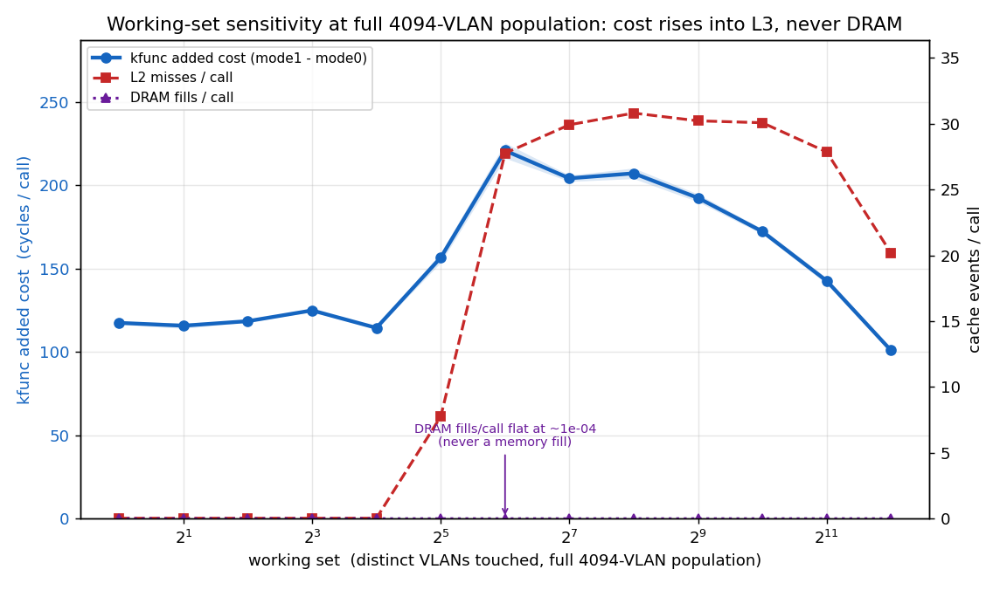

# bpf_xdp_egress_dev cost bench

A microbench of what one `bpf_xdp_egress_dev()` call adds to an XDP program. The
kfunc resolves a VLAN ifindex to its physical parent; the cost is one
`dev_get_by_index_rcu()`. Shared as part of our research toward a new VLAN XDP
kfunc, not a benchmark of anything shipped.

Cost is `mode1 - mode0` per cell, measured two ways: a `PROG_TEST_RUN` self-PMU
loop (micro, 11 paired runs/cell) and a real XDP program read with `perf stat -b`
(literal). Cycles are the primary metric, ns derived from the measured clock.
Kernel `7.1.0-14078-g39f1d383ccb2` (non-ship bpf-next), AMD Ryzen 9 7900,
isolation verified. Method in the `run_kfunc.sh` header.

## Result (median of 11 paired runs)

- ~48 cyc (~13 ns) warm, flat to ~512 VLANs; ~131 cyc (~35 ns) at the 4094
  ceiling (2.7x); ~220 cyc (~59 ns) under working-set pressure.
- DRAM fills/call ~1e-4 (4e-4 worst) everywhere, including cells with ~30 L2
  misses/call: L3-resident, never a DRAM fill.
- vs `bpf_fib_lookup` (~330 cyc warm, up to ~1000 under pressure): ~14% warm,
  ~33% at the ceiling, up to ~31% under footprint pressure.
- Throughput cost ~0.6% (population sweep) to ~2.8% (footprint), one veth sender
  core, a per-call-cost proxy not line rate.
- `net_rx_action` ~31% of host CPU under load.

All eight figures and the raw CSVs are in
[results/kfunc-bench-20260629-041705/](results/kfunc-bench-20260629-041705/).

## Notes

- `mode1 - mode0` is the kfunc's full cost, an upper bound on the split-over-fold
  delta (no fold variant measured).
- Non-ship build; the shipped kfunc adds `net_eq`/`ndo_xdp_xmit` gates this may
  lack, a few cycles.
- Clock is cycles/run time (~3.76 GHz, boost off); sysfs `scaling_cur_freq`'s
  nominal ~3.0 GHz is not used.
- Isolation: `isolcpus`/`nohz_full`/`rcu_nocbs`, performance governor, boost and
  prefetcher off, `perf_event_paranoid<=0`, `bpf_stats` on, single netns, knobs
  verified before measuring.

## Run

    make                          # builds vmlinux.h from your kernel, then all
    sudo ./run_kfunc.sh /out      # fresh timestamped subdir
    python3 analyze_kfunc.py /out/kfunc-bench-<ts>

Needs clang, gcc, bpftool, libbpf, perf, iproute2; numpy/pandas/scipy/matplotlib
to plot. Kernel must export `bpf_xdp_egress_dev` in BTF. Figures land in
`results/<run>/`: cost, sits, ab, footprint, dist, context, pps, controls.
